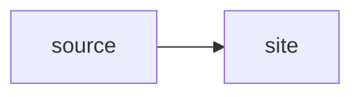

# Code-fence contract fixture

```sh title="command"
npm run build
```

~~~shell-session title="terminal transcript"
$ npm test
ok
~~~

```text title="plain output"
build complete
```

```yaml title="configuration"
enabled: true
```

```rust title="source code"
fn main() {}
```

```diff title="change"
-enabled: false
+enabled: true
```


